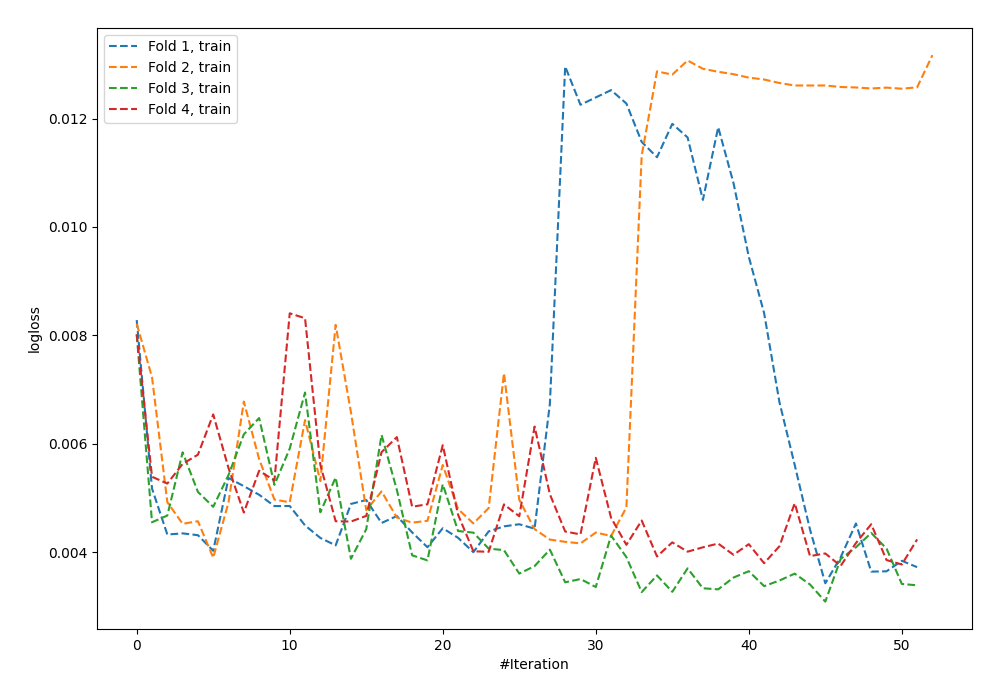
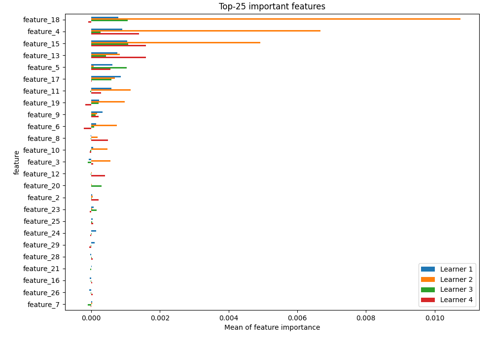
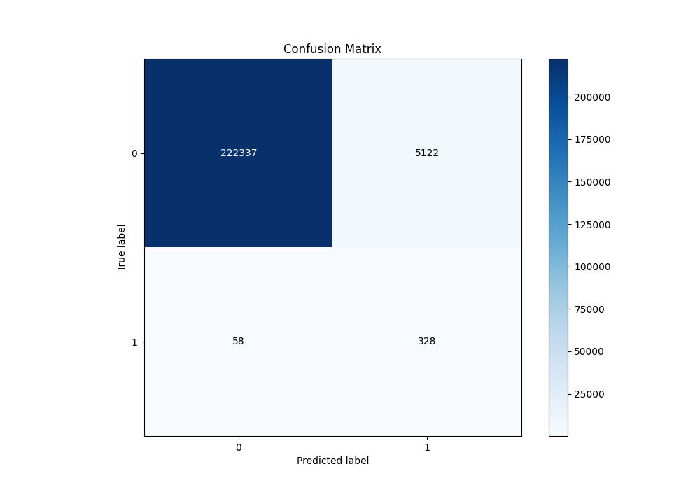
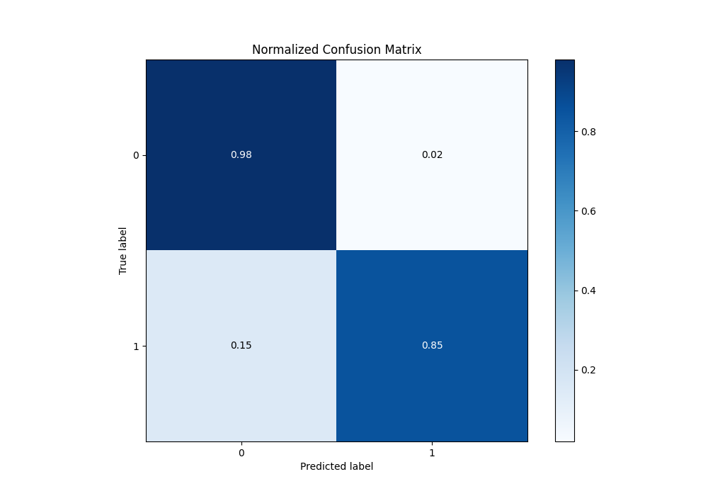
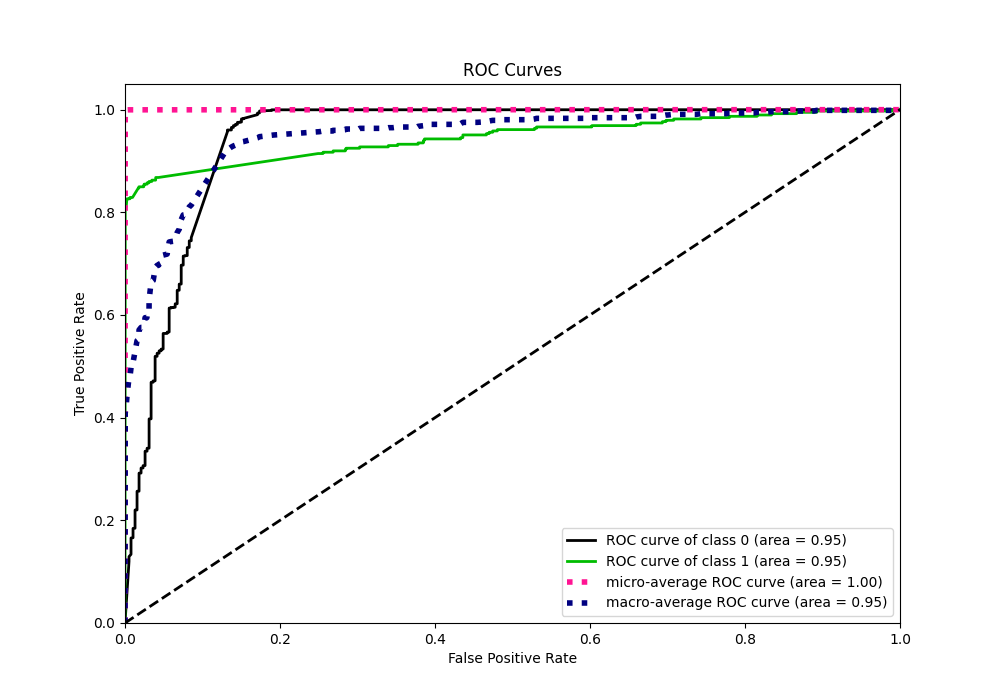
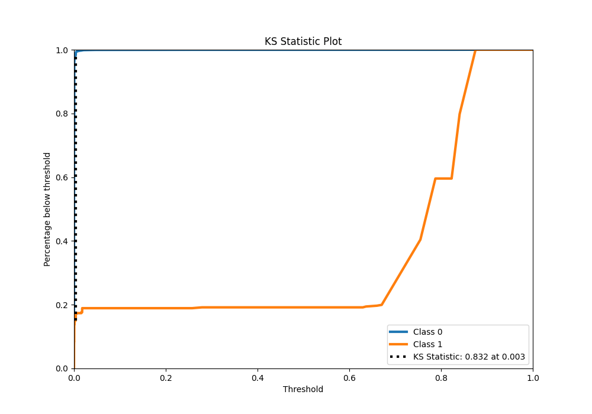
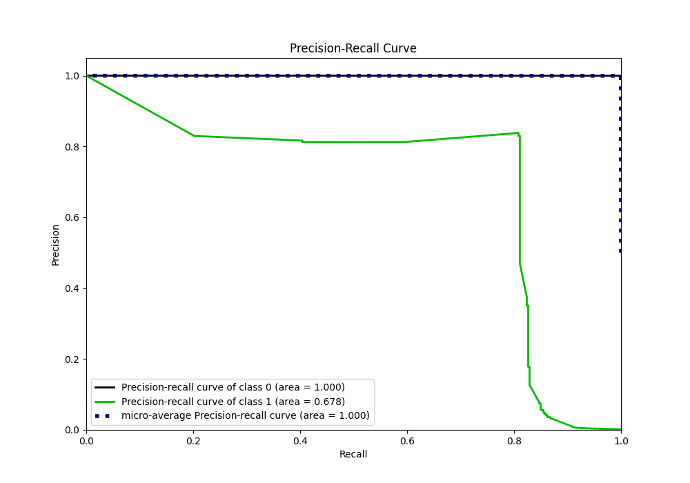
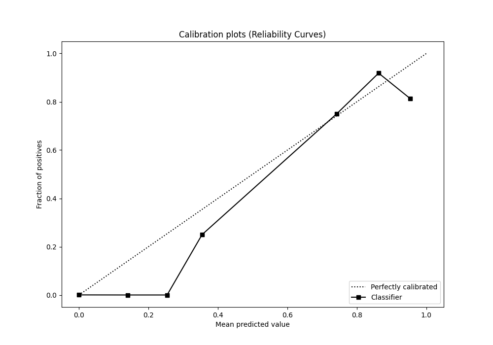
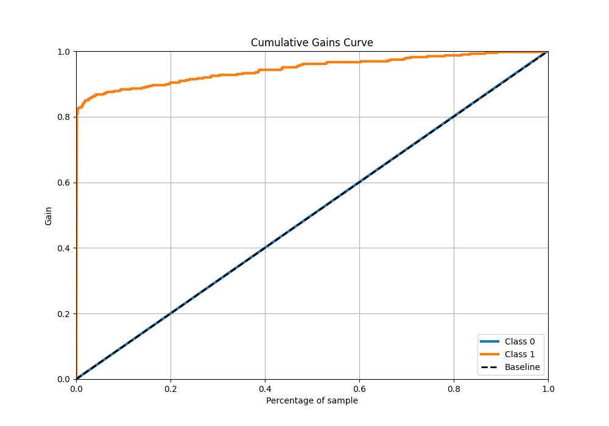
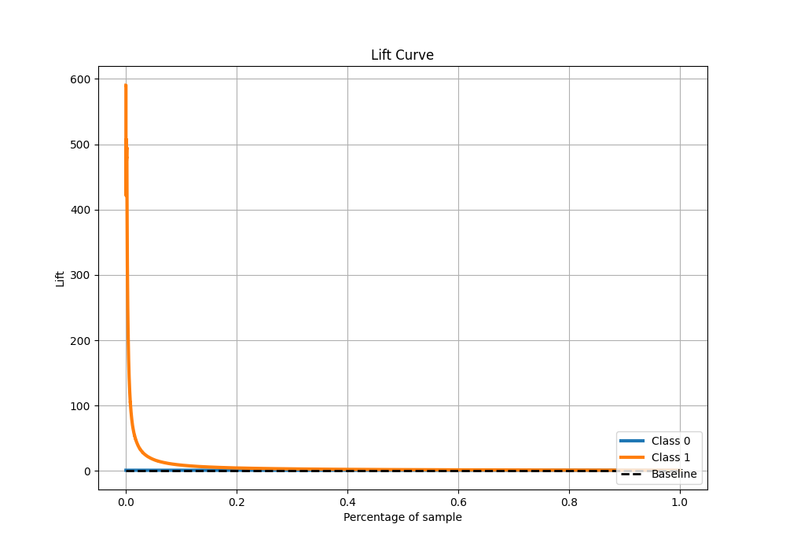

# Summary of 3_Default_NeuralNetwork

[<< Go back](../README.md)

## Neural Network
- **n_jobs**: -1
- **dense_1_size**: 32
- **dense_2_size**: 16
- **learning_rate**: 0.05
- **explain_level**: 2

## Validation
 - **validation_type**: kfold
 - **k_folds**: 4
 - **shuffle**: False
 - **stratify**: True

## Optimized metric
logloss

## Training time

212.9 seconds

## Metric details
|           |      score |      threshold |
|:----------|-----------:|---------------:|
| logloss   | 0.00400241 | nan            |
| auc       | 0.945962   | nan            |
| f1        | 0.112406   |   0.00188819   |
| accuracy  | 0.977265   |   0.00188819   |
| precision | 0.0601835  |   0.00188819   |
| recall    | 1          |   1.22467e-158 |
| mcc       | 0.222642   |   0.00188819   |

## Metric details with threshold from accuracy metric
|           |      score |    threshold |
|:----------|-----------:|-------------:|
| logloss   | 0.00400241 | nan          |
| auc       | 0.945962   | nan          |
| f1        | 0.112406   |   0.00188819 |
| accuracy  | 0.977265   |   0.00188819 |
| precision | 0.0601835  |   0.00188819 |
| recall    | 0.849741   |   0.00188819 |
| mcc       | 0.222642   |   0.00188819 |

## Confusion matrix (at threshold=0.001888)
|              |   Predicted as 0 |   Predicted as 1 |
|:-------------|-----------------:|-----------------:|
| Labeled as 0 |           222337 |             5122 |
| Labeled as 1 |               58 |              328 |

## Learning curves

## Permutation-based Importance

## Confusion Matrix

## Normalized Confusion Matrix

## ROC Curve

## Kolmogorov-Smirnov Statistic

## Precision-Recall Curve

## Calibration Curve

## Cumulative Gains Curve

## Lift Curve

[<< Go back](../README.md)
