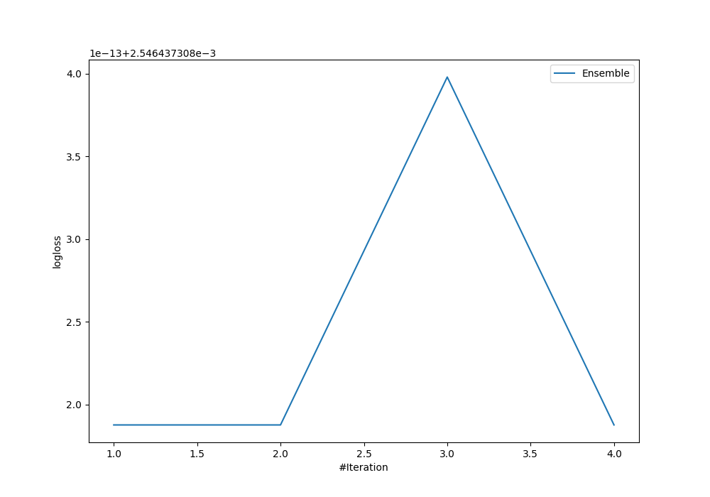
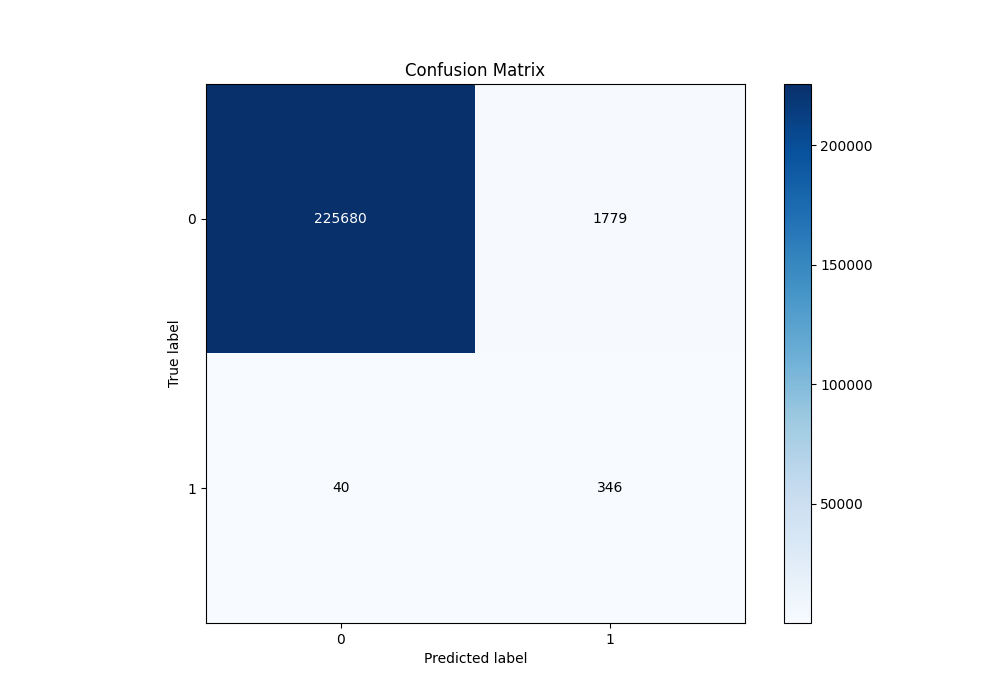
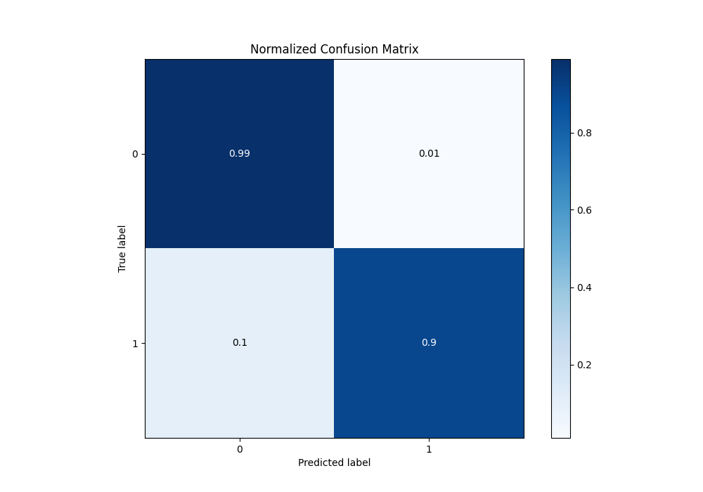
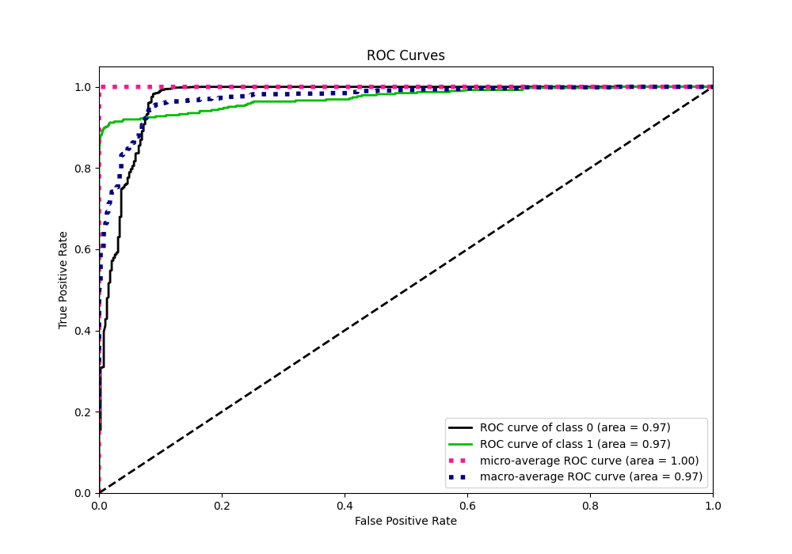
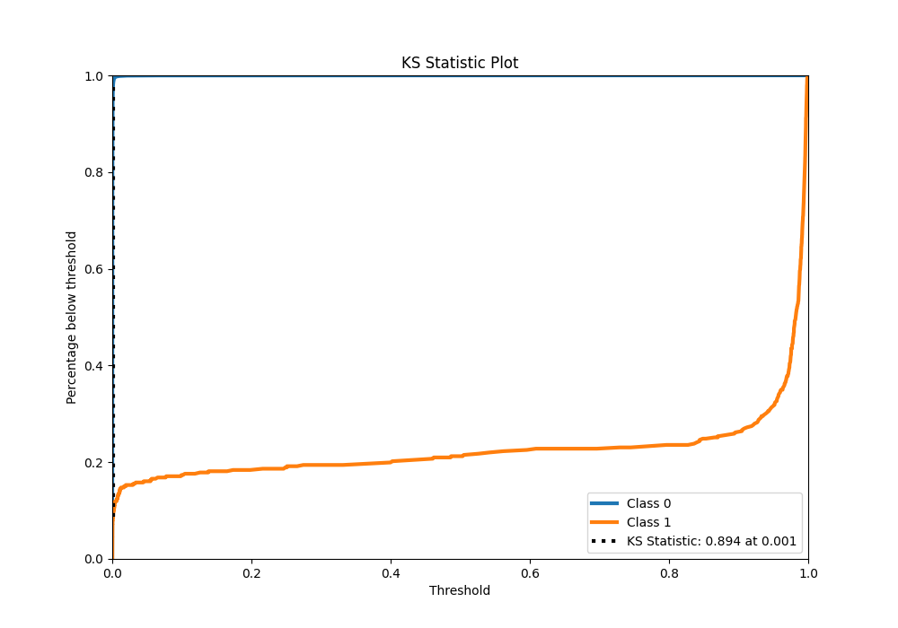
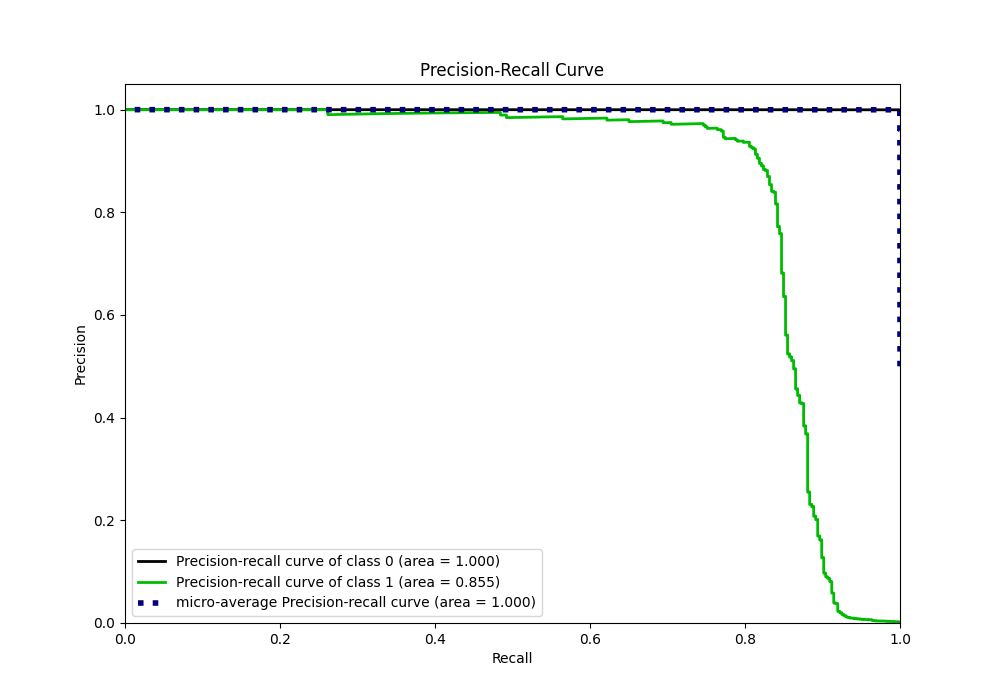
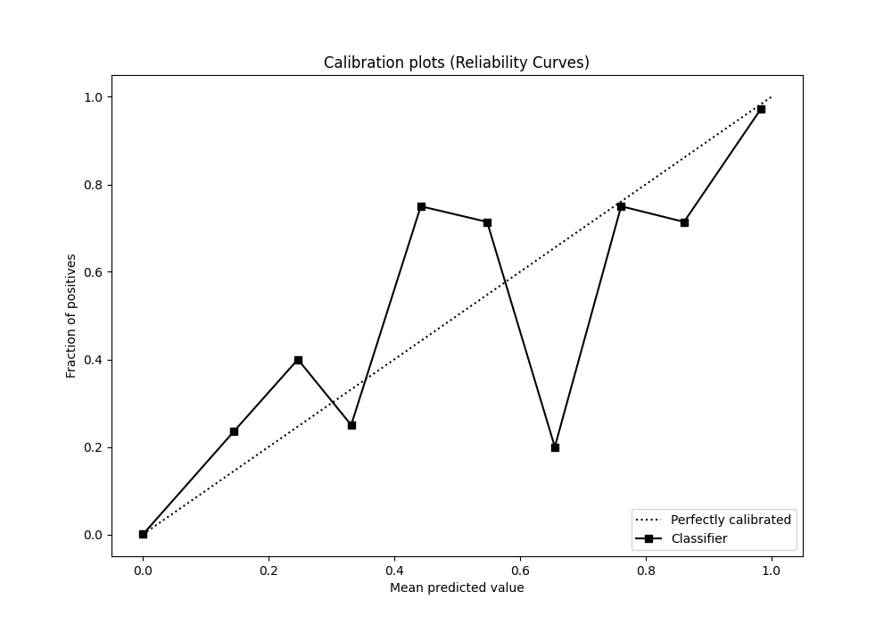
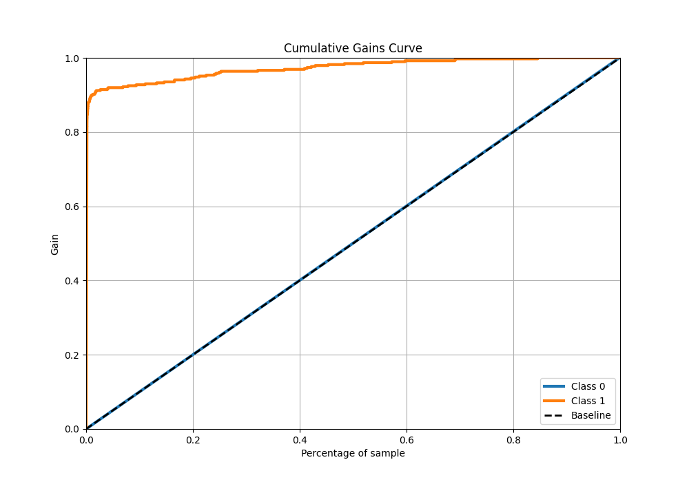
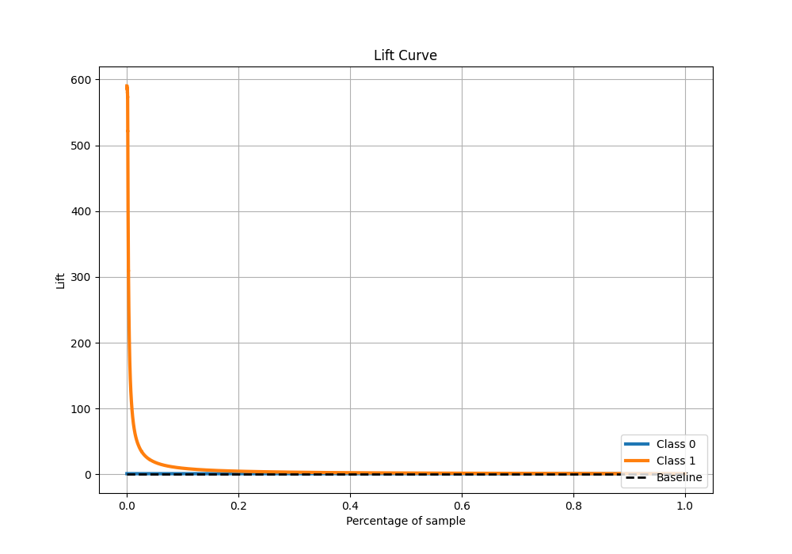

# Summary of Ensemble

[<< Go back](../README.md)

## Ensemble structure
| Model             |   Weight |
|:------------------|---------:|
| 2_Default_Xgboost |        1 |

## Metric details
|           |      score |     threshold |
|:----------|-----------:|--------------:|
| logloss   | 0.00254644 | nan           |
| auc       | 0.973061   | nan           |
| f1        | 0.275587   |   0.00244505  |
| accuracy  | 0.992017   |   0.00244505  |
| precision | 0.162824   |   0.00244505  |
| recall    | 1          |   1.61615e-05 |
| mcc       | 0.380157   |   0.00244505  |

## Metric details with threshold from accuracy metric
|           |      score |    threshold |
|:----------|-----------:|-------------:|
| logloss   | 0.00254644 | nan          |
| auc       | 0.973061   | nan          |
| f1        | 0.275587   |   0.00244505 |
| accuracy  | 0.992017   |   0.00244505 |
| precision | 0.162824   |   0.00244505 |
| recall    | 0.896373   |   0.00244505 |
| mcc       | 0.380157   |   0.00244505 |

## Confusion matrix (at threshold=0.002445)
|              |   Predicted as 0 |   Predicted as 1 |
|:-------------|-----------------:|-----------------:|
| Labeled as 0 |           225680 |             1779 |
| Labeled as 1 |               40 |              346 |

## Learning curves

## Confusion Matrix

## Normalized Confusion Matrix

## ROC Curve

## Kolmogorov-Smirnov Statistic

## Precision-Recall Curve

## Calibration Curve

## Cumulative Gains Curve

## Lift Curve

[<< Go back](../README.md)
