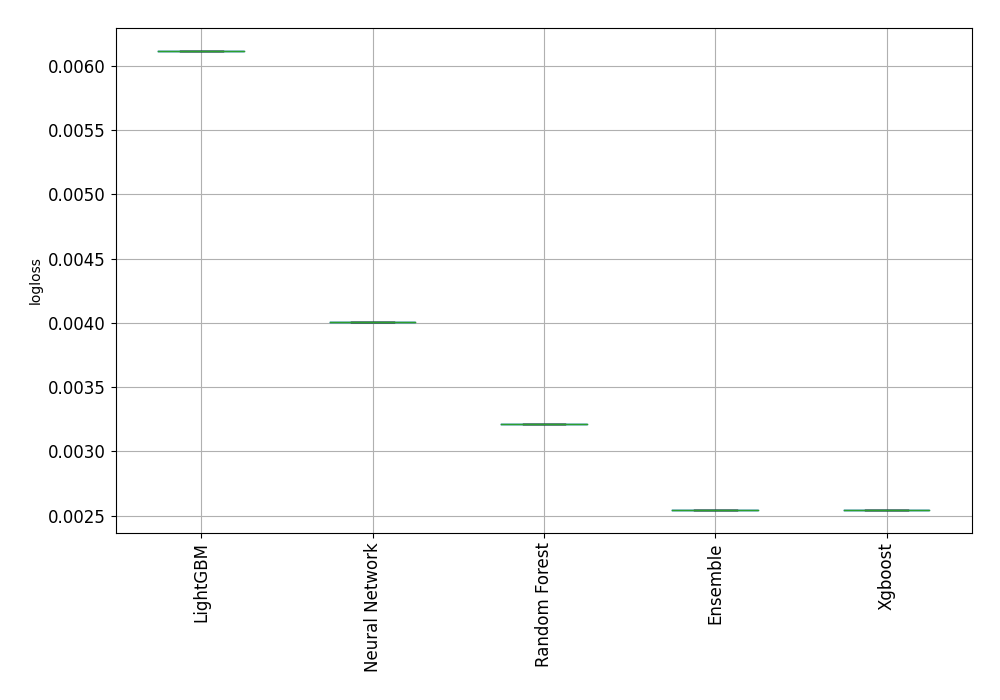

# AutoML Leaderboard

| Best model   | name                                                         | model_type     | metric_type   |   metric_value |   train_time |
|:-------------|:-------------------------------------------------------------|:---------------|:--------------|---------------:|-------------:|
|              | [1_Default_LightGBM](1_Default_LightGBM/README.md)           | LightGBM       | logloss       |     0.00611666 |        69.18 |
| **the best** | [2_Default_Xgboost](2_Default_Xgboost/README.md)             | Xgboost        | logloss       |     0.00254644 |        93.62 |
|              | [3_Default_NeuralNetwork](3_Default_NeuralNetwork/README.md) | Neural Network | logloss       |     0.00400241 |       215.41 |
|              | [4_Default_RandomForest](4_Default_RandomForest/README.md)   | Random Forest  | logloss       |     0.0032097  |       283.45 |
|              | [Ensemble](Ensemble/README.md)                               | Ensemble       | logloss       |     0.00254644 |        25.16 |

### AutoML Performance

### AutoML Performance Boxplot

### Features Importance

### Spearman Correlation of Models

