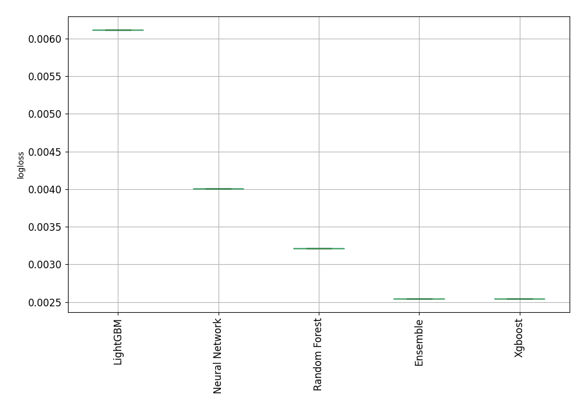
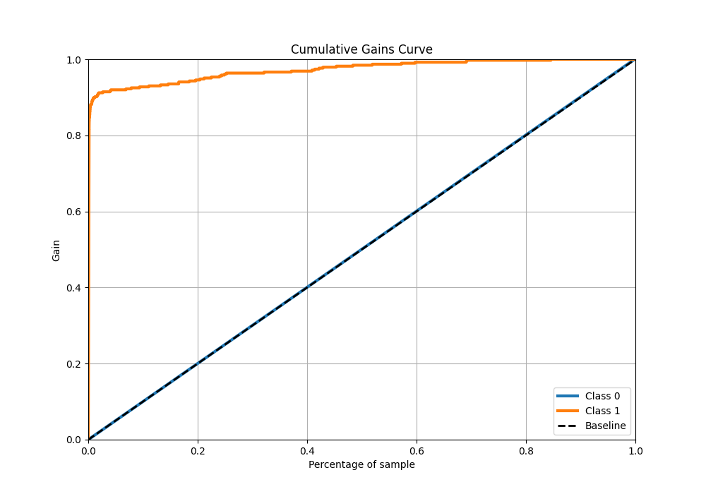
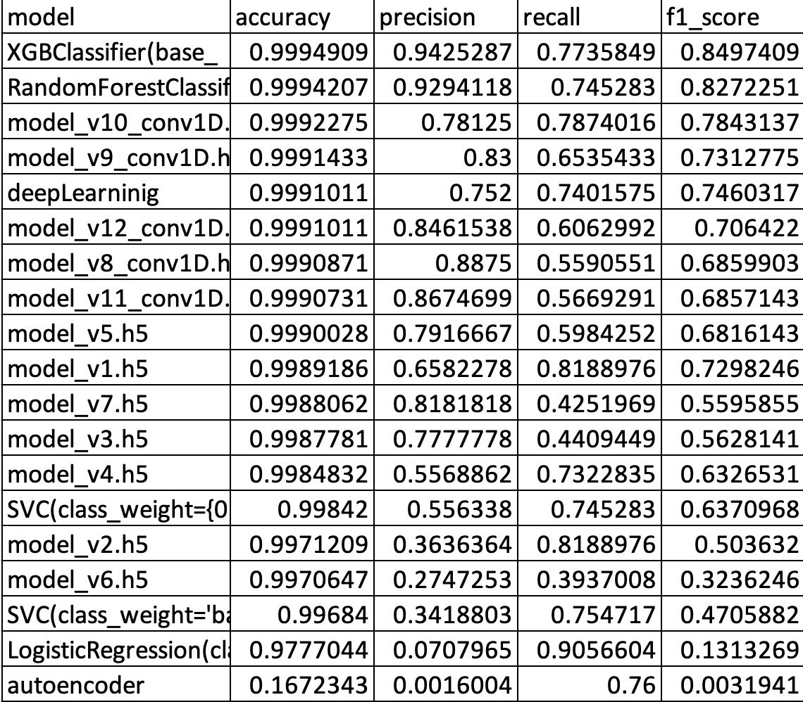

# CreditFraudDetection
In this project, I am exploring credit card fraud activity.

It was reported that Federal Trade Commission received 2.8 million fraud reports from consumers in 2021. Consumers loss reached $5.8 billion which is 70% higher than 2020. Fraudsters are using more advanced techniques, such as machine learning, to target new customers, online transactions, and stealing identities. Currently, many models have been proposed to improve the fraud detection including KNN, logistic regression, SVM etc. For data preprocessing, data under-sampling, over-sampling, feature selection (PCA, logistic regression, SVM) have been widely used. There is report that credit card fraud detection recall can reach 0.94. However, based on the previous year’s report, fraudulent activities increase more and more. Fraudsters are using machine learning techniques to avoid defence machine learning algorithms. Simply label outliers or defining outliers are not satisfying the needs to identify attacking pattern. 

A platform that contains data streaming, data preprocessing (feature selection, auto-labeling, grouping), model selection, model training, model relearn based on live transaction data, and prediction is highly needed. The data-model live interaction will facilitate the model selection and updating, which will further enhance the anomaly detection speed.

In the first step, I will explore different classfication models with the same set of data. By comparing their performance, hopefully, the best model will be selected for the task.

In the second step, I will explore GAN simulation data as live transaction data to feed the model for prediction. And use monitoring service for the model.

# Base model exploration
## Data exploration
* Since the data is highly imbalanced, the preprocessing of the data is needed. In the current steps, undersampling method is explored for the model selection. Also, in LogisticRegression, 'balanced' weight is used for the model.
* The nature of the data provides an unique way for auto-encoder model. Basically, data 
* Explore correlation, remove highly correlated data.
* Understand the data trend with visulization tools.

## Select model with autoML for several classification models
* Models include LightGBM','Xgboost','Random Forest','Neural Network'.
* XGBoost showed the best performance among other classifications models.

    
    

## Use autoencoder model to do the test
* Deep learning with dense layer.
* Difference between Standard Scaler and minMax scaler. The former has large loss around 2.7 and it hardly decreases in the first 30 epochs. The latter gives smaller loss 
* add dropout layer to solve overfitting problem.
* refer to keras.loss, we can identify that binary_crossentropy is better than mae, since the latter is better for regression. When using binary_crossentropy, we should normalize the data in the range [0,1], that is MinMaxScaler insead of standard scaler.
* outliers in the data will cause train the test data huge difference.

## SMOTE synthetic minority oversampling 

# Summary of various models performance:
* XGBC classifier demonstrates the highest accuracy score.
* Conv1D model shows the highest recall score, and f1_score.
* Autoencoder shows the poorest performance overall.

    
